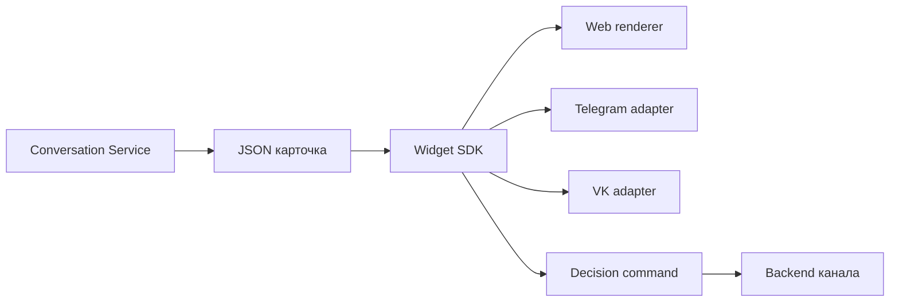

# Архитектура

SDK состоит из трёх простых частей:

- снимок опубликованной JSON Schema;
- generated TypeScript type;
- runtime-проверка и создание команды решения.

Renderer и сеть находятся снаружи. Благодаря этому библиотека работает в браузере, Node.js и
будущем мобильном адаптере без зависимости от одного UI framework.
