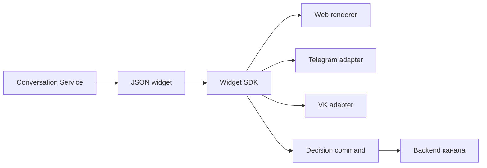

# Архитектура

```mermaid
flowchart LR
    Conversation[Conversation Service] --> Widget[JSON widget]
    Widget --> SDK[Widget SDK]
    SDK --> Web[Web renderer]
    SDK --> TG[Telegram adapter]
    SDK --> VK[VK adapter]
    SDK --> Command[Decision command]
    Command --> Backend[Backend канала]
```

SDK состоит из четырёх простых частей:

- снимок опубликованной JSON Schema;
- generated TypeScript type;
- runtime-проверка;
- создание команды решения только для карточки подтверждения.

Виджет подключения содержит текст и HTTPS-ссылку. SDK проверяет данные, но не открывает ссылку и не
хранит OAuth state. Конкретный renderer решает, как показать кнопку.

Renderer и сеть находятся снаружи. Благодаря этому библиотека работает в браузере, Node.js и
будущем мобильном адаптере без зависимости от одного UI framework.
